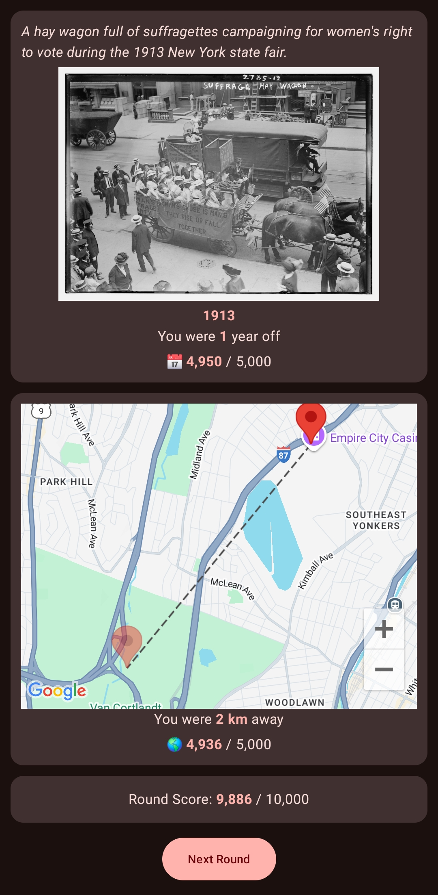
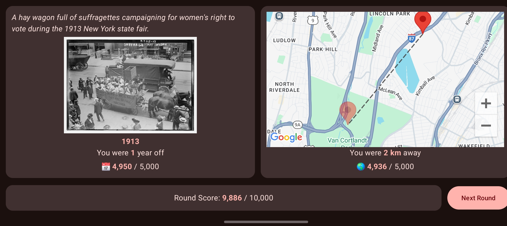
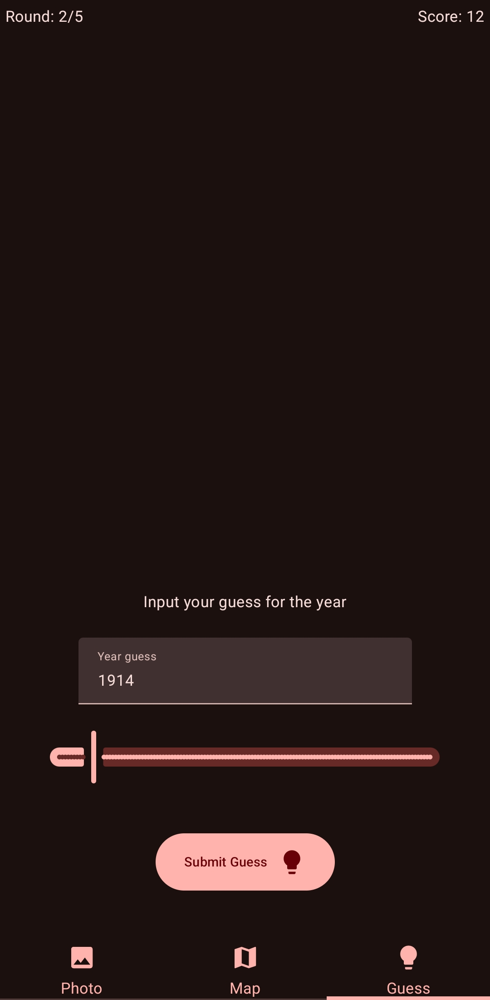
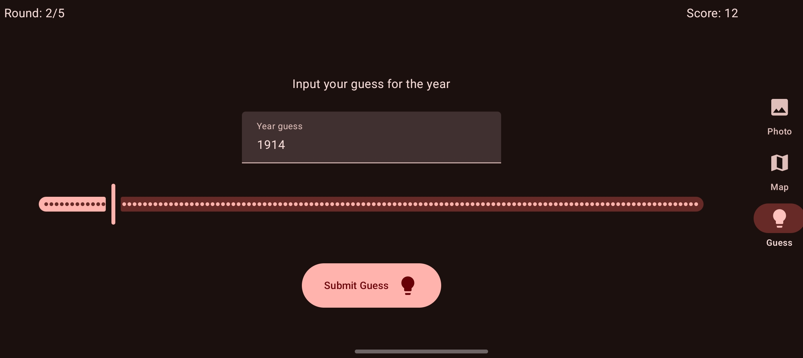
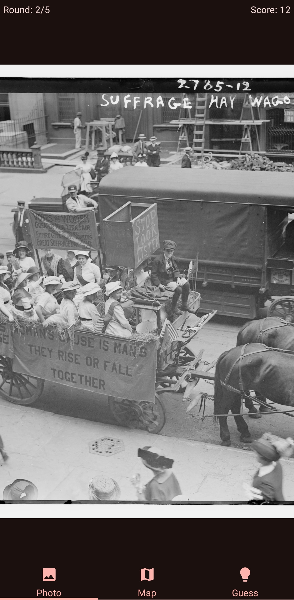
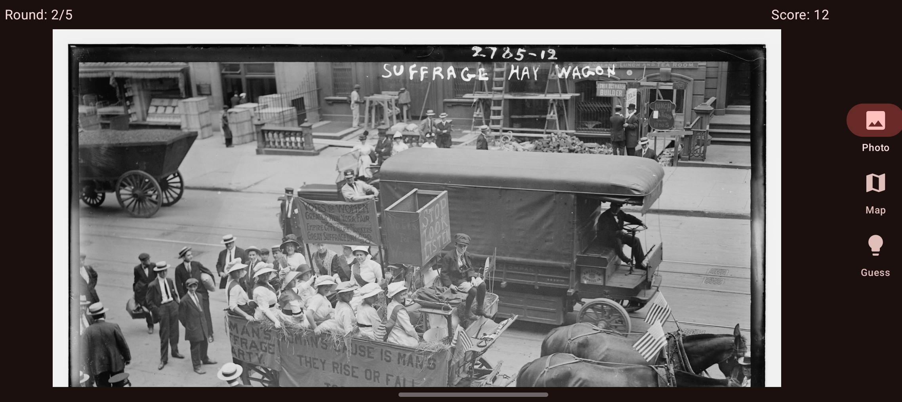
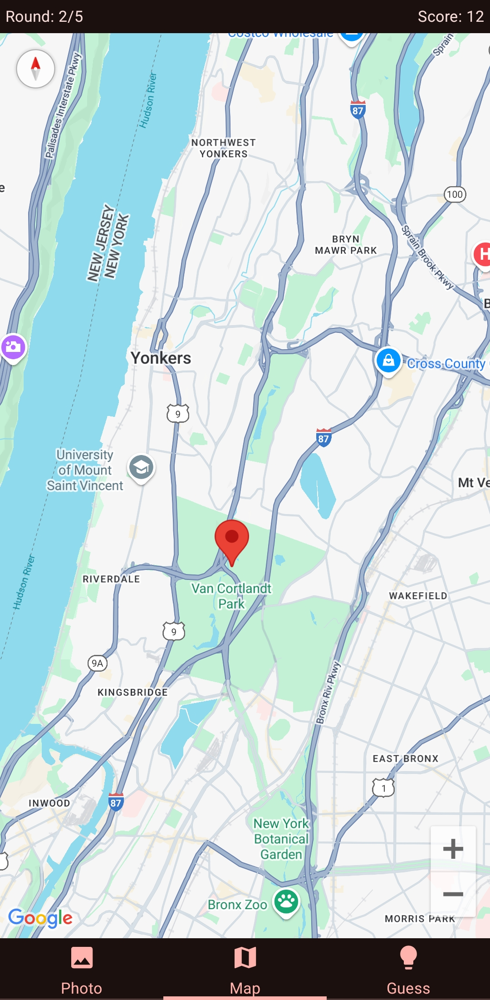
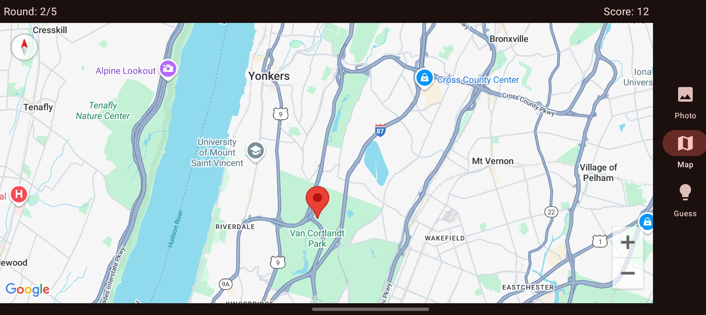
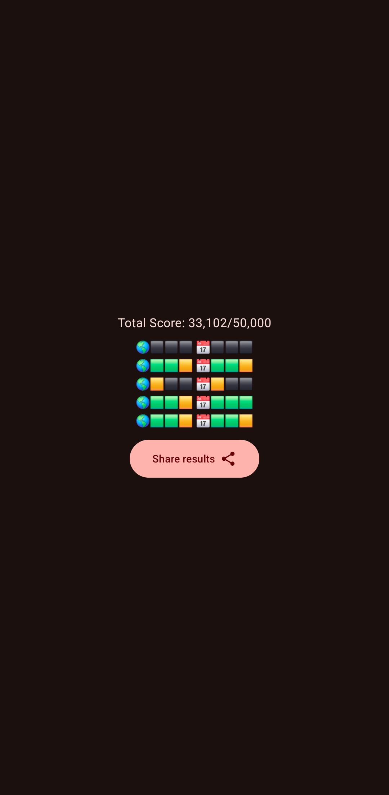

# Timeguessr Mobile

This is an unofficial Android client for playing the daily game of TimeGuessr.

My goal was to have a simple app, where one can play the daily game in native controls, making it easy and nice to use.

## Screenshots

### Round result

### Guess

### Photo

### Map

### Final result

## What, why?

### What is TimeGuessr?

Timeguessr is a web app that I enjoy playing.

In short, every day there is a set of photos and you must guess the year and location. At the end, you have a score that you can share with your friends.

### What's the issue?

The website is good for desktop, but on mobile devices, it's not the best.

I encountered some issues with scrolling, zooming, moving into landscape mode.